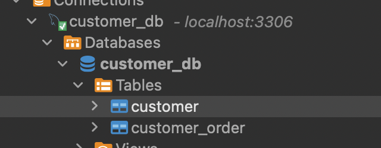

# Agentic NLP to SQL

This repository demonstrates a production-ready implementation of Natural Language Processing (NLP) to SQL conversion architecture for AI agents. While many NLP to SQL solutions work well with simple demo datasets, this implementation is specifically designed to handle complex real-world database schemas and relationships, maintaining high accuracy even with complex ERP systems.

For a detailed explanation of the architecture and its evolution, please refer to our article: [Production Ready NLP to SQL architecture for your AI Agents](https://medium.com/ideaboxai/production-ready-nlp-to-sql-architecture-for-your-ai-agents-697d00499f8d?sk=5380ec18f783f6040806d69a9295cd30)

## Background

At IdeaboxAI, we've found that 4 out of 5 AI use cases require NLP to SQL integration, primarily because structured data sources continue to dominate the market. This implementation addresses the common challenge of moving from POC to production, where most current NLP to SQL architectures struggle with complex real-world schemas.

## Key Features

- Production-grade NLP to SQL conversion architecture
- Robust handling of complex database schemas and relationships
- Vector-based semantic search for database tables
- Automatic relationship discovery between tables
- Support for MySQL and PostgreSQL databases
- Configurable processing pipeline
- Demo database setup with sample PC hardware store data
- High accuracy with complex ERP systems (maintaining 90%+ accuracy)

## Demo

[](https://youtu.be/sykR4iugT7Y)

## Architecture Overview

The system uses a sophisticated approach that combines:
- Vector-based semantic search for database metadata
- Automatic relationship discovery
- Context-aware query generation
- Robust error handling and validation
- Production-ready deployment considerations

This architecture has been tested and proven to maintain high accuracy (90%+) even with complex real-world ERP systems, unlike many common NLP to SQL solutions that drop to 50-60% accuracy with complex schemas.

## Features

- Database table ingestion and model generation
- Vector-based semantic search for database tables
- Automatic relationship discovery between tables
- Support for MySQL and PostgreSQL databases. It can be extended to any other databases like MSSQL, Oracle, etc.
- Configurable processing pipeline
- Demo database setup with sample PC hardware store data

## Prerequisites

- Python 3.11+
- OpenAI API key
- MySQL or PostgreSQL database access
- Conda or Poetry package manager
- Docker and Docker Compose (for local database setup)

## Installation

### Option 1: Using Conda (Recommended)

1. Clone the repository:

```bash
git clone https://github.com/vithushanms/agentic-nlp-to-sql.git
cd agentic-nlp-to-sql
```

2. Create and activate the conda environment:

```bash
conda env create -f environment.yml
conda activate agentic-nlp-to-sql
```

3. Install dependencies using Poetry:

```bash
poetry install
```

### Option 2: Using Poetry Directly

1. Clone the repository:

```bash
git clone https://github.com/vithushanms/agentic-nlp-to-sql.git
cd agentic-nlp-to-sql
```

2. Install dependencies:

```bash
poetry install
```

3. Activate the virtual environment:

```bash
poetry shell
```

### Environment Configuration

Create a `.env` file in the project root with your configuration:

```bash
cp .env.example .env
```

Required environment variables:

```plaintext
OPENAI_API_KEY=your_openai_api_key
DATASOURCE_TYPE=mysql  # or postgresql
DB_USER=store_user
DB_PASS=store_password
DB_HOST=localhost
DB_PORT=3306
DB_NAME=customer_db
```

## Database Setup

The project includes a simple demo database setup where you can test the NLP to SQL architecture. But, you can use it with your own database by changing the credentials in the `.env` file. If you're bringing your own database, you can skip the following steps in the Database Setup section.

1. Start the MySQL container:

```bash
docker-compose up -d
```

1. Initialize the database with sample data:

```bash
python init/init_db.py
```



The demo database includes:
- Customer table with sample customer data
- Customer order table with sample order data
- Realistic relationships between customers and orders
- Various order statuses, payment statuses, and shipping terms

Database credentials:
- Host: localhost
- Port: 3306
- Database: customer_db
- Username: store_user
- Password: store_password
- Root Password: rootpassword

## Ingestion, Vectorization and Relationship Generation

The following command will ingest the database tables, vectorize them and generate the semantic relationships. 

```bash
python main.py --context "This is a online store where, the shop sell PC hardware. The customers are from various locations and the orders are being tracked in the source database attached here" --tables "customer_db:customer" "customer_db:customer_order"
```

The above command is based on the demo database setup. You can change the context and tables to your own business context and tables. this cli command will support the following arguments:
- `--context`: Business context for semantic understanding (required)
- `--tables`: List of database tables in format 'database:table' (required)
- `--test-queries`: Test queries for vector search (optional) to see the retrieval effectiveness of the vector index.

## Output from the ingestion process

The tool generates three types of output in the `fs_cache` directory:

1. `models/`: Contains JSON files for each table's structure
2. `vector_index/`: Contains the vector search index
3. `relationships/`: Contains the generated relationship files

## Agent Notebook

You can test the system using the [agent notebook](agent.ipynb). The notebook provides an interactive environment to:
- See the reasoning steps for each query
- View the generated SQL
- Examine the query results
- Debug and refine queries
- Test the system's robustness with edge cases

Example queries to test production scenarios:
- Complex joins: "Show me all active customers with pending orders and their total order amounts"
- Aggregations: "What are the total orders by status and payment method?"
- Date-based queries: "List customers who placed orders in the last 30 days"
- Business logic: "Show me orders with total amount greater than $1000 that are still pending"
- Error handling: "Find customers with invalid email addresses"

## Project Structure

```
agentic-nlp-to-sql/
├── main.py                 # Main CLI interface
├── agent.ipynb             # Agent notebook
├── ingestion.py           # Database table ingestion
├── vector_index.py        # Vector search functionality
├── semantic_relationship.py # Relationship generation
├── pyproject.toml         # Poetry dependencies
├── environment.yml        # Conda environment
├── docker-compose.yml     # Docker configuration for local database
├── requirements.txt       # Python dependencies
├── .env                   # Environment configuration
├── init/                  # Database initialization scripts
│   └── init_db.py        # Database setup and sample data
└── fs_cache/             # Generated files
    ├── models/           # Table structure files
    ├── vector_index/     # Search index
    └── relationships/    # Relationship files
```

## Dependencies

The project uses several key dependencies:
- langchain and related packages for LLM integration
- FAISS for vector similarity search
- SQLAlchemy for database operations
- OpenAI for embeddings and completions
- mysql-connector-python for database connectivity

For a complete list of dependencies, see `pyproject.toml`.

## Contributing

Contributions are welcome! Please feel free to submit a Pull Request.

## License

MIT License

